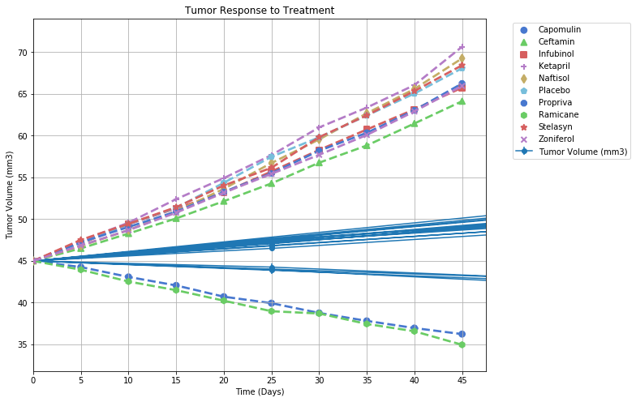
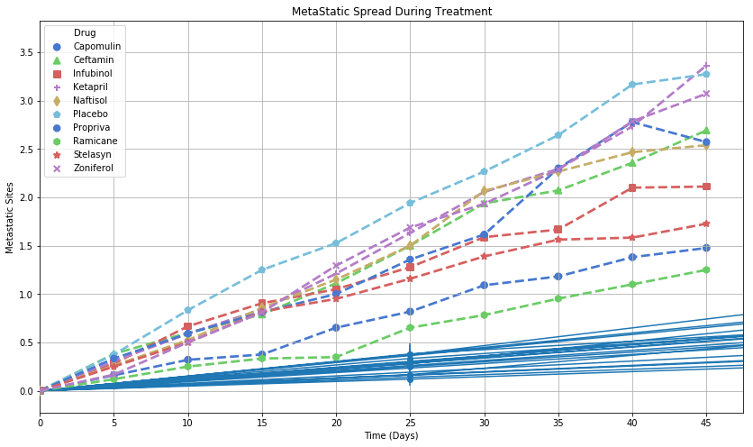
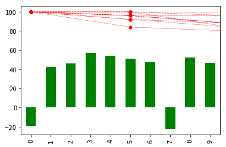

# Pymaceuticals Inc.

### __Analysis__ 


```python
# Import Dependencies
import pandas as pd
import numpy as np
import matplotlib.pyplot as plt
import seaborn as sns
from scipy import stats

# Read csv data
clintrial_df = pd.read_csv("raw_data/clinicaltrial_data.csv")
drug_df = pd.read_csv("raw_data/mouse_drug_data.csv")

# Remove duplicate value from clintrial_df (take the first value of duplicated ID and Timepoint)
clintrial_df = clintrial_df.drop_duplicates(subset = ['Mouse ID', 'Timepoint'], keep= 'first')
# clintrial_df.loc[clintrial_df["Mouse ID"] == 'g989']

# Merge both dataframes
merged_df = pd.merge(clintrial_df, drug_df, on="Mouse ID", how="outer")
# print(len(merged_df))
merged_df.sort_values(by = ['Mouse ID','Timepoint']).head(10)
```


<div>
<style>
    .dataframe thead tr:only-child th {
        text-align: right;
    }

    .dataframe thead th {
        text-align: left;
    }

    .dataframe tbody tr th {
        vertical-align: top;
    }
</style>
<table border="1" class="dataframe">
  <thead>
    <tr style="text-align: right;">
      <th></th>
      <th>Mouse ID</th>
      <th>Timepoint</th>
      <th>Tumor Volume (mm3)</th>
      <th>Metastatic Sites</th>
      <th>Drug</th>
    </tr>
  </thead>
  <tbody>
    <tr>
      <th>901</th>
      <td>a203</td>
      <td>0</td>
      <td>45.000000</td>
      <td>0</td>
      <td>Infubinol</td>
    </tr>
    <tr>
      <th>902</th>
      <td>a203</td>
      <td>5</td>
      <td>48.508468</td>
      <td>0</td>
      <td>Infubinol</td>
    </tr>
    <tr>
      <th>903</th>
      <td>a203</td>
      <td>10</td>
      <td>51.852437</td>
      <td>1</td>
      <td>Infubinol</td>
    </tr>
    <tr>
      <th>904</th>
      <td>a203</td>
      <td>15</td>
      <td>52.777870</td>
      <td>1</td>
      <td>Infubinol</td>
    </tr>
    <tr>
      <th>905</th>
      <td>a203</td>
      <td>20</td>
      <td>55.173336</td>
      <td>1</td>
      <td>Infubinol</td>
    </tr>
    <tr>
      <th>906</th>
      <td>a203</td>
      <td>25</td>
      <td>56.793208</td>
      <td>1</td>
      <td>Infubinol</td>
    </tr>
    <tr>
      <th>907</th>
      <td>a203</td>
      <td>30</td>
      <td>59.523197</td>
      <td>1</td>
      <td>Infubinol</td>
    </tr>
    <tr>
      <th>908</th>
      <td>a203</td>
      <td>35</td>
      <td>61.931650</td>
      <td>2</td>
      <td>Infubinol</td>
    </tr>
    <tr>
      <th>909</th>
      <td>a203</td>
      <td>40</td>
      <td>63.593490</td>
      <td>2</td>
      <td>Infubinol</td>
    </tr>
    <tr>
      <th>910</th>
      <td>a203</td>
      <td>45</td>
      <td>67.973419</td>
      <td>2</td>
      <td>Infubinol</td>
    </tr>
  </tbody>
</table>
</div>


### __Tumor Response to Treatment__


```python
#Take the merged_df and group by both Drug and Timepoint
tresp_df = merged_df.copy()
tresp_df = tresp_df.groupby(['Drug','Timepoint']).mean()['Tumor Volume (mm3)']
# tresp_df = tresp_df.set_index(['Drug','Timepoint'], inplace=True)
trmt_df = pd.DataFrame(tresp_df)

# tresp_df = tresp_df.rename(columns={0:'Tumor Volumne (mm3)'})
# tresp_df
# df = df.rename(columns= {0: 'list'})
# df = df.set_index(['Company', 'date'], inplace=True)
# df.index.name = 'index'
# pd.DataFrame({'email':sf.index, 'list':sf.values})
# tresp_df.rename(index = str, columns = {'Tumor Volume (mm3)'}, inplace = True) 
# tresp_df.rename('Tumor Volume (mm3)')
trmt_df
```


<div>
<style>
    .dataframe thead tr:only-child th {
        text-align: right;
    }

    .dataframe thead th {
        text-align: left;
    }

    .dataframe tbody tr th {
        vertical-align: top;
    }
</style>
<table border="1" class="dataframe">
  <thead>
    <tr style="text-align: right;">
      <th></th>
      <th></th>
      <th>Tumor Volume (mm3)</th>
    </tr>
    <tr>
      <th>Drug</th>
      <th>Timepoint</th>
      <th></th>
    </tr>
  </thead>
  <tbody>
    <tr>
      <th rowspan="10" valign="top">Capomulin</th>
      <th>0</th>
      <td>45.000000</td>
    </tr>
    <tr>
      <th>5</th>
      <td>44.266086</td>
    </tr>
    <tr>
      <th>10</th>
      <td>43.084291</td>
    </tr>
    <tr>
      <th>15</th>
      <td>42.064317</td>
    </tr>
    <tr>
      <th>20</th>
      <td>40.716325</td>
    </tr>
    <tr>
      <th>25</th>
      <td>39.939528</td>
    </tr>
    <tr>
      <th>30</th>
      <td>38.769339</td>
    </tr>
    <tr>
      <th>35</th>
      <td>37.816839</td>
    </tr>
    <tr>
      <th>40</th>
      <td>36.958001</td>
    </tr>
    <tr>
      <th>45</th>
      <td>36.236114</td>
    </tr>
    <tr>
      <th rowspan="10" valign="top">Ceftamin</th>
      <th>0</th>
      <td>45.000000</td>
    </tr>
    <tr>
      <th>5</th>
      <td>46.503051</td>
    </tr>
    <tr>
      <th>10</th>
      <td>48.285125</td>
    </tr>
    <tr>
      <th>15</th>
      <td>50.094055</td>
    </tr>
    <tr>
      <th>20</th>
      <td>52.157049</td>
    </tr>
    <tr>
      <th>25</th>
      <td>54.287674</td>
    </tr>
    <tr>
      <th>30</th>
      <td>56.769517</td>
    </tr>
    <tr>
      <th>35</th>
      <td>58.827548</td>
    </tr>
    <tr>
      <th>40</th>
      <td>61.467895</td>
    </tr>
    <tr>
      <th>45</th>
      <td>64.132421</td>
    </tr>
    <tr>
      <th rowspan="10" valign="top">Infubinol</th>
      <th>0</th>
      <td>45.000000</td>
    </tr>
    <tr>
      <th>5</th>
      <td>47.062001</td>
    </tr>
    <tr>
      <th>10</th>
      <td>49.403909</td>
    </tr>
    <tr>
      <th>15</th>
      <td>51.296397</td>
    </tr>
    <tr>
      <th>20</th>
      <td>53.197691</td>
    </tr>
    <tr>
      <th>25</th>
      <td>55.715252</td>
    </tr>
    <tr>
      <th>30</th>
      <td>58.299397</td>
    </tr>
    <tr>
      <th>35</th>
      <td>60.742461</td>
    </tr>
    <tr>
      <th>40</th>
      <td>63.162824</td>
    </tr>
    <tr>
      <th>45</th>
      <td>65.755562</td>
    </tr>
    <tr>
      <th>...</th>
      <th>...</th>
      <td>...</td>
    </tr>
    <tr>
      <th rowspan="10" valign="top">Ramicane</th>
      <th>0</th>
      <td>45.000000</td>
    </tr>
    <tr>
      <th>5</th>
      <td>43.944859</td>
    </tr>
    <tr>
      <th>10</th>
      <td>42.531957</td>
    </tr>
    <tr>
      <th>15</th>
      <td>41.495061</td>
    </tr>
    <tr>
      <th>20</th>
      <td>40.238325</td>
    </tr>
    <tr>
      <th>25</th>
      <td>38.974300</td>
    </tr>
    <tr>
      <th>30</th>
      <td>38.703137</td>
    </tr>
    <tr>
      <th>35</th>
      <td>37.451996</td>
    </tr>
    <tr>
      <th>40</th>
      <td>36.574081</td>
    </tr>
    <tr>
      <th>45</th>
      <td>34.955595</td>
    </tr>
    <tr>
      <th rowspan="10" valign="top">Stelasyn</th>
      <th>0</th>
      <td>45.000000</td>
    </tr>
    <tr>
      <th>5</th>
      <td>47.525662</td>
    </tr>
    <tr>
      <th>10</th>
      <td>49.444904</td>
    </tr>
    <tr>
      <th>15</th>
      <td>51.442472</td>
    </tr>
    <tr>
      <th>20</th>
      <td>54.037882</td>
    </tr>
    <tr>
      <th>25</th>
      <td>56.166123</td>
    </tr>
    <tr>
      <th>30</th>
      <td>59.826738</td>
    </tr>
    <tr>
      <th>35</th>
      <td>62.440699</td>
    </tr>
    <tr>
      <th>40</th>
      <td>65.356386</td>
    </tr>
    <tr>
      <th>45</th>
      <td>68.438310</td>
    </tr>
    <tr>
      <th rowspan="10" valign="top">Zoniferol</th>
      <th>0</th>
      <td>45.000000</td>
    </tr>
    <tr>
      <th>5</th>
      <td>46.851818</td>
    </tr>
    <tr>
      <th>10</th>
      <td>48.689881</td>
    </tr>
    <tr>
      <th>15</th>
      <td>50.779059</td>
    </tr>
    <tr>
      <th>20</th>
      <td>53.170334</td>
    </tr>
    <tr>
      <th>25</th>
      <td>55.432935</td>
    </tr>
    <tr>
      <th>30</th>
      <td>57.713531</td>
    </tr>
    <tr>
      <th>35</th>
      <td>60.089372</td>
    </tr>
    <tr>
      <th>40</th>
      <td>62.916692</td>
    </tr>
    <tr>
      <th>45</th>
      <td>65.960888</td>
    </tr>
  </tbody>
</table>
<p>100 rows × 1 columns</p>
</div>


```python
# Metastatic sites for 'Capomulin
cap_df = merged_df.copy()
cap_df = cap_df.groupby(['Drug','Timepoint'])['Tumor Volume (mm3)'].sem()
cap_df = pd.DataFrame(cap_df)
# cap_df.loc['Capomulin',:]
cap_df.head()
```


<div>
<style>
    .dataframe thead tr:only-child th {
        text-align: right;
    }

    .dataframe thead th {
        text-align: left;
    }

    .dataframe tbody tr th {
        vertical-align: top;
    }
</style>
<table border="1" class="dataframe">
  <thead>
    <tr style="text-align: right;">
      <th></th>
      <th></th>
      <th>Tumor Volume (mm3)</th>
    </tr>
    <tr>
      <th>Drug</th>
      <th>Timepoint</th>
      <th></th>
    </tr>
  </thead>
  <tbody>
    <tr>
      <th rowspan="5" valign="top">Capomulin</th>
      <th>0</th>
      <td>0.000000</td>
    </tr>
    <tr>
      <th>5</th>
      <td>0.448593</td>
    </tr>
    <tr>
      <th>10</th>
      <td>0.702684</td>
    </tr>
    <tr>
      <th>15</th>
      <td>0.838617</td>
    </tr>
    <tr>
      <th>20</th>
      <td>0.909731</td>
    </tr>
  </tbody>
</table>
</div>


```python
# Use Tumor Response df to pivot setting Timepoint as index and Drug as columns
pvttv_df = trmt_df.copy()
pvttv_df = pvttv_df.reset_index(level = ('Drug', 'Timepoint'))
pvttv_df = pvttv_df.pivot(index = "Timepoint", columns = "Drug")["Tumor Volume (mm3)"]
pvttv_df
```


<div>
<style>
    .dataframe thead tr:only-child th {
        text-align: right;
    }

    .dataframe thead th {
        text-align: left;
    }

    .dataframe tbody tr th {
        vertical-align: top;
    }
</style>
<table border="1" class="dataframe">
  <thead>
    <tr style="text-align: right;">
      <th>Drug</th>
      <th>Capomulin</th>
      <th>Ceftamin</th>
      <th>Infubinol</th>
      <th>Ketapril</th>
      <th>Naftisol</th>
      <th>Placebo</th>
      <th>Propriva</th>
      <th>Ramicane</th>
      <th>Stelasyn</th>
      <th>Zoniferol</th>
    </tr>
    <tr>
      <th>Timepoint</th>
      <th></th>
      <th></th>
      <th></th>
      <th></th>
      <th></th>
      <th></th>
      <th></th>
      <th></th>
      <th></th>
      <th></th>
    </tr>
  </thead>
  <tbody>
    <tr>
      <th>0</th>
      <td>45.000000</td>
      <td>45.000000</td>
      <td>45.000000</td>
      <td>45.000000</td>
      <td>45.000000</td>
      <td>45.000000</td>
      <td>45.000000</td>
      <td>45.000000</td>
      <td>45.000000</td>
      <td>45.000000</td>
    </tr>
    <tr>
      <th>5</th>
      <td>44.266086</td>
      <td>46.503051</td>
      <td>47.062001</td>
      <td>47.389175</td>
      <td>46.796098</td>
      <td>47.125589</td>
      <td>47.235574</td>
      <td>43.944859</td>
      <td>47.525662</td>
      <td>46.851818</td>
    </tr>
    <tr>
      <th>10</th>
      <td>43.084291</td>
      <td>48.285125</td>
      <td>49.403909</td>
      <td>49.582269</td>
      <td>48.694210</td>
      <td>49.423329</td>
      <td>49.066132</td>
      <td>42.531957</td>
      <td>49.444904</td>
      <td>48.689881</td>
    </tr>
    <tr>
      <th>15</th>
      <td>42.064317</td>
      <td>50.094055</td>
      <td>51.296397</td>
      <td>52.399974</td>
      <td>50.933018</td>
      <td>51.359742</td>
      <td>50.918900</td>
      <td>41.495061</td>
      <td>51.442472</td>
      <td>50.779059</td>
    </tr>
    <tr>
      <th>20</th>
      <td>40.716325</td>
      <td>52.157049</td>
      <td>53.197691</td>
      <td>54.920935</td>
      <td>53.644087</td>
      <td>54.364417</td>
      <td>53.264805</td>
      <td>40.238325</td>
      <td>54.037882</td>
      <td>53.170334</td>
    </tr>
    <tr>
      <th>25</th>
      <td>39.939528</td>
      <td>54.287674</td>
      <td>55.715252</td>
      <td>57.678982</td>
      <td>56.731968</td>
      <td>57.482574</td>
      <td>55.504138</td>
      <td>38.974300</td>
      <td>56.166123</td>
      <td>55.432935</td>
    </tr>
    <tr>
      <th>30</th>
      <td>38.769339</td>
      <td>56.769517</td>
      <td>58.299397</td>
      <td>60.994507</td>
      <td>59.559509</td>
      <td>59.809063</td>
      <td>58.196374</td>
      <td>38.703137</td>
      <td>59.826738</td>
      <td>57.713531</td>
    </tr>
    <tr>
      <th>35</th>
      <td>37.816839</td>
      <td>58.827548</td>
      <td>60.742461</td>
      <td>63.371686</td>
      <td>62.685087</td>
      <td>62.420615</td>
      <td>60.350199</td>
      <td>37.451996</td>
      <td>62.440699</td>
      <td>60.089372</td>
    </tr>
    <tr>
      <th>40</th>
      <td>36.958001</td>
      <td>61.467895</td>
      <td>63.162824</td>
      <td>66.068580</td>
      <td>65.600754</td>
      <td>65.052675</td>
      <td>63.045537</td>
      <td>36.574081</td>
      <td>65.356386</td>
      <td>62.916692</td>
    </tr>
    <tr>
      <th>45</th>
      <td>36.236114</td>
      <td>64.132421</td>
      <td>65.755562</td>
      <td>70.662958</td>
      <td>69.265506</td>
      <td>68.084082</td>
      <td>66.258529</td>
      <td>34.955595</td>
      <td>68.438310</td>
      <td>65.960888</td>
    </tr>
  </tbody>
</table>
</div>


#### Graph of Tumor Response to Treatment 
-  x-axis: Time (Days); y-axis: Tumor Volume (mm3)
-  include: Labels, Title, Legend, ErrorBars.


```python
gphtr_df = trmt_df.copy()
gphtr_df = gphtr_df.reset_index(level = ['Drug','Timepoint'])
gphtr_df = gphtr_df.rename(columns = {'Timepoint':'Time (Days)'})

markers = ["o","^","s","+","d","p","8","h","*","x"]
linesty = ["--","--","--","--","--","--","--","--","--","--"]
# gphtr_df

sem = merged_df.copy()
sem = sem.groupby(["Drug", "Timepoint"]).sem()["Tumor Volume (mm3)"]
sem_df = pd.DataFrame(sem)

sem_df = sem_df.reset_index(level = ("Drug", "Timepoint"))
sem_df = sem_df.rename(columns = {'Timepoint':'Time (Days)',
                                 'Tumor Volume (mm3)':'Standard Error'})

tr_df = trmt_df.reset_index(level = ("Drug", "Timepoint"))
tr_df = tr_df['Tumor Volume (mm3)']

sem_df['Tumor Volume (mm3)'] = tr_df
# sem_df

pivot_sem_df = sem_df.pivot(index="Time (Days)", columns="Drug")["Standard Error"]
# # pivot_sem_df
yerr = sem_df['Standard Error']
x = sem_df['Time (Days)']
y = sem_df['Tumor Volume (mm3)']
# hue = sem_df['Drug']
y

fig_dims = (10, 8)
fig, ax = plt.subplots(figsize = fig_dims)
ax = sns.pointplot('Time (Days)','Tumor Volume (mm3)', hue = 'Drug', data = gphtr_df,
             ci = "sd", markers = markers, linestyles = linesty, 
             palette = sns.color_palette("muted",10), errwidth = 0.1, capsize = 0.2)
ax.set(xlim = (0, None))
plt.errorbar(x, y, yerr = yerr, fmt = '-o')
# plt.show()

#yerr = sem_df['Standard Error']
plt.gca().grid(True)
plt.legend(bbox_to_anchor=(1.05,1),loc =2)
plt.title("Tumor Response to Treatment")
plt.show()
```





### __Metastatic Response to Treatment__


```python
# Create a DataFrame that compares Metastatic Sites to 'Drug' & 'Timepoint' indices
meta_df = merged_df.copy()
meta_df = meta_df.groupby(['Drug','Timepoint']).mean()['Metastatic Sites']
meta_df = pd.DataFrame(meta_df)
meta_df.head()
```


<div>
<style>
    .dataframe thead tr:only-child th {
        text-align: right;
    }

    .dataframe thead th {
        text-align: left;
    }

    .dataframe tbody tr th {
        vertical-align: top;
    }
</style>
<table border="1" class="dataframe">
  <thead>
    <tr style="text-align: right;">
      <th></th>
      <th></th>
      <th>Metastatic Sites</th>
    </tr>
    <tr>
      <th>Drug</th>
      <th>Timepoint</th>
      <th></th>
    </tr>
  </thead>
  <tbody>
    <tr>
      <th rowspan="5" valign="top">Capomulin</th>
      <th>0</th>
      <td>0.000000</td>
    </tr>
    <tr>
      <th>5</th>
      <td>0.160000</td>
    </tr>
    <tr>
      <th>10</th>
      <td>0.320000</td>
    </tr>
    <tr>
      <th>15</th>
      <td>0.375000</td>
    </tr>
    <tr>
      <th>20</th>
      <td>0.652174</td>
    </tr>
  </tbody>
</table>
</div>


```python
# Standard Error for Metastatic Sites
stderr_msresp = merged_df.copy()
stderr_msresp = stderr_msresp.groupby(['Drug','Timepoint']).sem()['Metastatic Sites']
stderr_msresp = pd.DataFrame(stderr_msresp)
stderr_msresp.head()

```


<div>
<style>
    .dataframe thead tr:only-child th {
        text-align: right;
    }

    .dataframe thead th {
        text-align: left;
    }

    .dataframe tbody tr th {
        vertical-align: top;
    }
</style>
<table border="1" class="dataframe">
  <thead>
    <tr style="text-align: right;">
      <th></th>
      <th></th>
      <th>Metastatic Sites</th>
    </tr>
    <tr>
      <th>Drug</th>
      <th>Timepoint</th>
      <th></th>
    </tr>
  </thead>
  <tbody>
    <tr>
      <th rowspan="5" valign="top">Capomulin</th>
      <th>0</th>
      <td>0.000000</td>
    </tr>
    <tr>
      <th>5</th>
      <td>0.074833</td>
    </tr>
    <tr>
      <th>10</th>
      <td>0.125433</td>
    </tr>
    <tr>
      <th>15</th>
      <td>0.132048</td>
    </tr>
    <tr>
      <th>20</th>
      <td>0.161621</td>
    </tr>
  </tbody>
</table>
</div>


```python
# Create Pivot df of meta_df (mean)
pvtms_df = meta_df.copy()
pvtms_df = pvtms_df.reset_index(level = ('Drug', 'Timepoint'))
pvtms_df = pvtms_df.pivot(index = "Timepoint", columns = "Drug")["Metastatic Sites"]
pvtms_df
```


<div>
<style>
    .dataframe thead tr:only-child th {
        text-align: right;
    }

    .dataframe thead th {
        text-align: left;
    }

    .dataframe tbody tr th {
        vertical-align: top;
    }
</style>
<table border="1" class="dataframe">
  <thead>
    <tr style="text-align: right;">
      <th>Drug</th>
      <th>Capomulin</th>
      <th>Ceftamin</th>
      <th>Infubinol</th>
      <th>Ketapril</th>
      <th>Naftisol</th>
      <th>Placebo</th>
      <th>Propriva</th>
      <th>Ramicane</th>
      <th>Stelasyn</th>
      <th>Zoniferol</th>
    </tr>
    <tr>
      <th>Timepoint</th>
      <th></th>
      <th></th>
      <th></th>
      <th></th>
      <th></th>
      <th></th>
      <th></th>
      <th></th>
      <th></th>
      <th></th>
    </tr>
  </thead>
  <tbody>
    <tr>
      <th>0</th>
      <td>0.000000</td>
      <td>0.000000</td>
      <td>0.000000</td>
      <td>0.000000</td>
      <td>0.000000</td>
      <td>0.000000</td>
      <td>0.000000</td>
      <td>0.000000</td>
      <td>0.000000</td>
      <td>0.000000</td>
    </tr>
    <tr>
      <th>5</th>
      <td>0.160000</td>
      <td>0.380952</td>
      <td>0.280000</td>
      <td>0.304348</td>
      <td>0.260870</td>
      <td>0.375000</td>
      <td>0.333333</td>
      <td>0.120000</td>
      <td>0.250000</td>
      <td>0.166667</td>
    </tr>
    <tr>
      <th>10</th>
      <td>0.320000</td>
      <td>0.600000</td>
      <td>0.666667</td>
      <td>0.590909</td>
      <td>0.523810</td>
      <td>0.833333</td>
      <td>0.590909</td>
      <td>0.250000</td>
      <td>0.500000</td>
      <td>0.500000</td>
    </tr>
    <tr>
      <th>15</th>
      <td>0.375000</td>
      <td>0.789474</td>
      <td>0.904762</td>
      <td>0.842105</td>
      <td>0.857143</td>
      <td>1.250000</td>
      <td>0.812500</td>
      <td>0.333333</td>
      <td>0.818182</td>
      <td>0.809524</td>
    </tr>
    <tr>
      <th>20</th>
      <td>0.652174</td>
      <td>1.111111</td>
      <td>1.050000</td>
      <td>1.210526</td>
      <td>1.150000</td>
      <td>1.526316</td>
      <td>1.000000</td>
      <td>0.347826</td>
      <td>0.950000</td>
      <td>1.294118</td>
    </tr>
    <tr>
      <th>25</th>
      <td>0.818182</td>
      <td>1.500000</td>
      <td>1.277778</td>
      <td>1.631579</td>
      <td>1.500000</td>
      <td>1.941176</td>
      <td>1.357143</td>
      <td>0.652174</td>
      <td>1.157895</td>
      <td>1.687500</td>
    </tr>
    <tr>
      <th>30</th>
      <td>1.090909</td>
      <td>1.937500</td>
      <td>1.588235</td>
      <td>2.055556</td>
      <td>2.066667</td>
      <td>2.266667</td>
      <td>1.615385</td>
      <td>0.782609</td>
      <td>1.388889</td>
      <td>1.933333</td>
    </tr>
    <tr>
      <th>35</th>
      <td>1.181818</td>
      <td>2.071429</td>
      <td>1.666667</td>
      <td>2.294118</td>
      <td>2.266667</td>
      <td>2.642857</td>
      <td>2.300000</td>
      <td>0.952381</td>
      <td>1.562500</td>
      <td>2.285714</td>
    </tr>
    <tr>
      <th>40</th>
      <td>1.380952</td>
      <td>2.357143</td>
      <td>2.100000</td>
      <td>2.733333</td>
      <td>2.466667</td>
      <td>3.166667</td>
      <td>2.777778</td>
      <td>1.100000</td>
      <td>1.583333</td>
      <td>2.785714</td>
    </tr>
    <tr>
      <th>45</th>
      <td>1.476190</td>
      <td>2.692308</td>
      <td>2.111111</td>
      <td>3.363636</td>
      <td>2.538462</td>
      <td>3.272727</td>
      <td>2.571429</td>
      <td>1.250000</td>
      <td>1.727273</td>
      <td>3.071429</td>
    </tr>
  </tbody>
</table>
</div>


#### Graph of Metastatic Spread During Treatment 
-  x-axis: Treatment Duration (Days); y-axis: Met. Sites
-  include: Labels, Title, Legend, ErrorBars.


```python
gphms_df = meta_df.copy()
gphms_df = gphms_df.reset_index(level = ['Drug','Timepoint'])
gphms_df = gphms_df.rename(columns = {'Timepoint':'Time (Days)'})
gphms_df = gphms_df['Metastatic Sites']

markers = ["o","^","s","+","d","p","8","h","*","x"]
linesty = ["--","--","--","--","--","--","--","--","--","--"]
# gphtr_df

sem_ms = merged_df.copy()
sem_ms = sem_ms.groupby(["Drug", "Timepoint"]).sem()["Metastatic Sites"]
sem_ms_df = pd.DataFrame(sem_ms)

sem_ms_df = sem_ms_df.reset_index(level = ("Drug", "Timepoint"))
sem_ms_df = sem_ms_df.rename(columns = {'Timepoint':'Time (Days)',
                                 'Metastatic Sites':'Standard Error'})

ms_df = meta_df.reset_index(level = ("Drug", "Timepoint"))
ms_df = ms_df.rename(columns= {"Timepoint":"Treatment Duration (Days)"})

# ms_df
sem_ms_df['Metastatic Sites'] = gphms_df

pivot_sem_ms_df = sem_ms_df.pivot(index="Time (Days)", columns="Drug")["Standard Error"]
# pivot_sem_ms_df
yerr = sem_ms_df['Standard Error']
x = sem_ms_df['Time (Days)']
y = sem_ms_df['Metastatic Sites']
# # hue = sem_df['Drug']

fig_dims = (14, 8)
fig, ax = plt.subplots(figsize = fig_dims)
ax = sns.pointplot(x, y, hue = 'Drug', data = gphtr_df,
             ci = "sd", markers = markers, linestyles = linesty, 
             palette = sns.color_palette("muted",10), errwidth = 0.1, capsize = 0.2)
ax.set(xlim = (0, None))
plt.errorbar(x, y, yerr = yerr, fmt = '-o')

#  #yerr = sem_df['Standard Error']
plt.gca().grid(True)
# plt.legend(bbox_to_anchor=(1.05,1),loc =2)
plt.title("MetaStatic Spread During Treatment")
plt.show()
```





### __Survival Rates__


```python
# Count remaining mice at each TimePoint for each drug
mcnt_df = merged_df.copy()
mcnt_df = mcnt_df.groupby(['Drug','Timepoint']).count()['Mouse ID']
mcnt_df = pd.DataFrame(mcnt_df)
mcnt_df = mcnt_df.rename(columns = {"Mouse ID":"Mouse Count"})
mcnt_df.head()
```


<div>
<style>
    .dataframe thead tr:only-child th {
        text-align: right;
    }

    .dataframe thead th {
        text-align: left;
    }

    .dataframe tbody tr th {
        vertical-align: top;
    }
</style>
<table border="1" class="dataframe">
  <thead>
    <tr style="text-align: right;">
      <th></th>
      <th></th>
      <th>Mouse Count</th>
    </tr>
    <tr>
      <th>Drug</th>
      <th>Timepoint</th>
      <th></th>
    </tr>
  </thead>
  <tbody>
    <tr>
      <th rowspan="5" valign="top">Capomulin</th>
      <th>0</th>
      <td>25</td>
    </tr>
    <tr>
      <th>5</th>
      <td>25</td>
    </tr>
    <tr>
      <th>10</th>
      <td>25</td>
    </tr>
    <tr>
      <th>15</th>
      <td>24</td>
    </tr>
    <tr>
      <th>20</th>
      <td>23</td>
    </tr>
  </tbody>
</table>
</div>


```python
# Pivot the table above to show a df with all treatments as columns.
pvt_mcnt = mcnt_df.copy()
pvt_mcnt = pvt_mcnt.reset_index(level = ('Drug','Timepoint'))
pvt_mcnt = pvt_mcnt.pivot(index = 'Timepoint', columns = 'Drug')['Mouse Count']
pvt_mcnt

```


<div>
<style>
    .dataframe thead tr:only-child th {
        text-align: right;
    }

    .dataframe thead th {
        text-align: left;
    }

    .dataframe tbody tr th {
        vertical-align: top;
    }
</style>
<table border="1" class="dataframe">
  <thead>
    <tr style="text-align: right;">
      <th>Drug</th>
      <th>Capomulin</th>
      <th>Ceftamin</th>
      <th>Infubinol</th>
      <th>Ketapril</th>
      <th>Naftisol</th>
      <th>Placebo</th>
      <th>Propriva</th>
      <th>Ramicane</th>
      <th>Stelasyn</th>
      <th>Zoniferol</th>
    </tr>
    <tr>
      <th>Timepoint</th>
      <th></th>
      <th></th>
      <th></th>
      <th></th>
      <th></th>
      <th></th>
      <th></th>
      <th></th>
      <th></th>
      <th></th>
    </tr>
  </thead>
  <tbody>
    <tr>
      <th>0</th>
      <td>25</td>
      <td>25</td>
      <td>25</td>
      <td>25</td>
      <td>25</td>
      <td>25</td>
      <td>25</td>
      <td>25</td>
      <td>25</td>
      <td>25</td>
    </tr>
    <tr>
      <th>5</th>
      <td>25</td>
      <td>21</td>
      <td>25</td>
      <td>23</td>
      <td>23</td>
      <td>24</td>
      <td>24</td>
      <td>25</td>
      <td>24</td>
      <td>24</td>
    </tr>
    <tr>
      <th>10</th>
      <td>25</td>
      <td>20</td>
      <td>21</td>
      <td>22</td>
      <td>21</td>
      <td>24</td>
      <td>22</td>
      <td>24</td>
      <td>22</td>
      <td>22</td>
    </tr>
    <tr>
      <th>15</th>
      <td>24</td>
      <td>19</td>
      <td>21</td>
      <td>19</td>
      <td>21</td>
      <td>20</td>
      <td>16</td>
      <td>24</td>
      <td>22</td>
      <td>21</td>
    </tr>
    <tr>
      <th>20</th>
      <td>23</td>
      <td>18</td>
      <td>20</td>
      <td>19</td>
      <td>20</td>
      <td>19</td>
      <td>16</td>
      <td>23</td>
      <td>20</td>
      <td>17</td>
    </tr>
    <tr>
      <th>25</th>
      <td>22</td>
      <td>18</td>
      <td>18</td>
      <td>19</td>
      <td>18</td>
      <td>17</td>
      <td>14</td>
      <td>23</td>
      <td>19</td>
      <td>16</td>
    </tr>
    <tr>
      <th>30</th>
      <td>22</td>
      <td>16</td>
      <td>17</td>
      <td>18</td>
      <td>15</td>
      <td>15</td>
      <td>13</td>
      <td>23</td>
      <td>18</td>
      <td>15</td>
    </tr>
    <tr>
      <th>35</th>
      <td>22</td>
      <td>14</td>
      <td>12</td>
      <td>17</td>
      <td>15</td>
      <td>14</td>
      <td>10</td>
      <td>21</td>
      <td>16</td>
      <td>14</td>
    </tr>
    <tr>
      <th>40</th>
      <td>21</td>
      <td>14</td>
      <td>10</td>
      <td>15</td>
      <td>15</td>
      <td>12</td>
      <td>9</td>
      <td>20</td>
      <td>12</td>
      <td>14</td>
    </tr>
    <tr>
      <th>45</th>
      <td>21</td>
      <td>13</td>
      <td>9</td>
      <td>11</td>
      <td>13</td>
      <td>11</td>
      <td>7</td>
      <td>20</td>
      <td>11</td>
      <td>14</td>
    </tr>
  </tbody>
</table>
</div>


#### Graph of Survival During Treatment 
-  x-axis: Time (Days); y-axis: Survival Rate (%)
-  include: Labels, Title, Legend, ErrorBars.


```python
#first calculate the survival rate
survival_pivot = pvt_mcnt

ca = plt.plot(100 * survival_pivot["Capomulin"] / survival_pivot["Capomulin"][0], "ro", linestyle="dashed", markersize=5, linewidth=0.50)
ce = plt.plot(100 * survival_pivot["Ceftamin"] / survival_pivot["Ceftamin"][0], "ro", linestyle="dashed", markersize=5, linewidth=0.50)
inf= plt.plot(100 * survival_pivot["Infubinol"] / survival_pivot["Infubinol"][0], "ro", linestyle="dashed", markersize=5, linewidth=0.50)
ket=plt.plot(100 * survival_pivot["Ketapril"] / survival_pivot["Ketapril"][0], "ro", linestyle="dashed", markersize=5, linewidth=0.50)
naf=plt.plot(100 * survival_pivot["Naftisol"] / survival_pivot["Naftisol"][0], "ro", linestyle="dashed", markersize=5, linewidth=0.50)
pla=plt.plot(100 * survival_pivot["Placebo"] / survival_pivot["Placebo"][0], "ro", linestyle="dashed", markersize=5, linewidth=0.50)
pro=plt.plot(100 * survival_pivot["Propriva"] / survival_pivot["Propriva"][0], "ro", linestyle="dashed", markersize=5, linewidth=0.50)
ram=plt.plot(100 * survival_pivot["Ramicane"] / survival_pivot["Ramicane"][0], "ro", linestyle="dashed", markersize=5, linewidth=0.50)
ste=plt.plot(100 * survival_pivot["Stelasyn"] / survival_pivot["Stelasyn"][0], "ro", linestyle="dashed", markersize=5, linewidth=0.50)
zon=plt.plot(100 * survival_pivot["Zoniferol"] / survival_pivot["Zoniferol"][0], "ro", linestyle="dashed", markersize=5, linewidth=0.50)
# plt.legend(entries= , keys = , labels= ,)
plt.show()

# srvl_rate

# gphmr_df = meta_df.copy()
# gphmr_df = gphmr_df.reset_index(level = ['Drug','Timepoint'])
# gphmr_df = gphmr_df.rename(columns = {'Timepoint':'Time (Days)'})

# markers = ["o","^","s","+","d","p","8","h","*","x"]
# linesty = ["--","--","--","--","--","--","--","--","--","--"]
# # gphmr_df
# fig_dims = (14, 12)
# fig, ax = plt.subplots(figsize = fig_dims)
# ax = sns.pointplot('Time (Days)','Metastatic Sites', hue = 'Drug', data = gphmr_df,
#              ci = "sd", markers = markers, linestyles = linesty, 
#              palette = sns.color_palette("muted",10))
# ax.set(xlim = (0, None))

# sem_mr = stderr_msresp.copy()
# sem_mr = sem_mr.reset_index(inplace=False)
# sem_mr = sem_mr['Metastatic Sites']
# # sem
# xy_mr = gphmr_df.copy()
# xy_mr = xy_mr.reset_index(inplace=False)
# x_mr = xy_mr['Time (Days)']
# y_mr = xy_mr['Metastatic Sites']

# plt.errorbar(x_mr, y_mr, yerr = sem_mr, fmt = 'o')
# plt.gca().grid(True)
# plt.title("Metastatic Spread During Treatment")
# plt.show()
```


    [<matplotlib.lines.Line2D at 0x2b4367d1f60>]


### __Summary Bar Graph__


```python
# Calculate the Tumor Vol Change % by Drug
tmr_chg = []
for column in pvttv_df:
    row_entry = (pvttv_df.iloc[-1,pvttv_df.columns.get_loc(column)] - \
                 pvttv_df.iloc[0,pvttv_df.columns.get_loc(column)]) \
                /pvttv_df.iloc[0,pvttv_df.columns.get_loc(column)] *100
    tmr_chg.append(row_entry)
# tmr_chg

drug_names = list(pvttv_df.columns.values)
# drug_names

tmr_vol = pd.DataFrame(list(zip(drug_names, tmr_chg)),
                       columns = ['Drug', '% Tumor Volume Change'])

tmr_vol = tmr_vol.set_index('Drug')
tmr_vol
# tmr_vol = pd.DataFrame()
```


<div>
<style>
    .dataframe thead tr:only-child th {
        text-align: right;
    }

    .dataframe thead th {
        text-align: left;
    }

    .dataframe tbody tr th {
        vertical-align: top;
    }
</style>
<table border="1" class="dataframe">
  <thead>
    <tr style="text-align: right;">
      <th></th>
      <th>% Tumor Volume Change</th>
    </tr>
    <tr>
      <th>Drug</th>
      <th></th>
    </tr>
  </thead>
  <tbody>
    <tr>
      <th>Capomulin</th>
      <td>-19.475303</td>
    </tr>
    <tr>
      <th>Ceftamin</th>
      <td>42.516492</td>
    </tr>
    <tr>
      <th>Infubinol</th>
      <td>46.123472</td>
    </tr>
    <tr>
      <th>Ketapril</th>
      <td>57.028795</td>
    </tr>
    <tr>
      <th>Naftisol</th>
      <td>53.923347</td>
    </tr>
    <tr>
      <th>Placebo</th>
      <td>51.297960</td>
    </tr>
    <tr>
      <th>Propriva</th>
      <td>47.241175</td>
    </tr>
    <tr>
      <th>Ramicane</th>
      <td>-22.320900</td>
    </tr>
    <tr>
      <th>Stelasyn</th>
      <td>52.085134</td>
    </tr>
    <tr>
      <th>Zoniferol</th>
      <td>46.579751</td>
    </tr>
  </tbody>
</table>
</div>


#### Graph of Tumor Change Over 45 Day Treatment
-  x-axis: Drug Names; y-axis: % Tumor Volume Change
-  include: Labels (w/i Bars), Title, Fill Bars {Green for (-)/Red for (+)


```python
tmr_vol = tmr_vol.reset_index()
x = tmr_vol["Drug"]
y = tmr_vol['% Tumor Volume Change']

tmr_vol['positive'] = tmr_vol['% Tumor Volume Change'] > 0
tmr_vol
# tmr_vol
tmr_vol['% Tumor Volume Change'].plot(kind='bar', color=tmr_vol.positive.map({True: 'r', False: 'g'}))
plt.show()

```





## Three Observations:
-  In this clinical trial only Capomulin and Ramicane showed a reduction in tumor volume.
-  The treatments about accounted for a survival rate of 80%.
-  All surviving mice display metastatic site growth by the end of the 45 day testing period.
